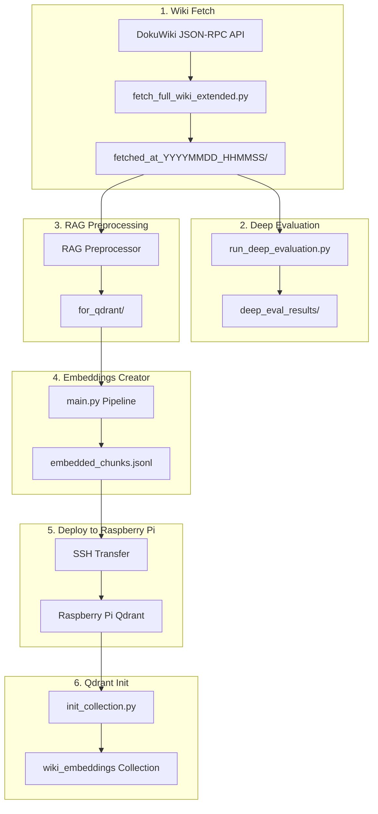

# Dev Dito Pipeline Manager - Integration des bestehenden Workflows

## Analysierter Workflow (bestehendes Techstack)



## Bestehende Quellen (aus sources_dev_dito.yaml)

| Komponente | Pfad |

|------------|------|

| **Wiki Fetcher** | `D:/_Repositories/_Diploma_Thesis_Repositories/research/techstack/dokuwiki/fetcher_json_rpc_api/script/fetch_full_wiki_extended.py` |

| **Fetch Output** | `D:/_Repositories/_Diploma_Thesis_Repositories/research/techstack/dokuwiki/fetcher_json_rpc_api/content_output/` |

| **Deep Evaluation** | `D:/_Repositories/_Diploma_Thesis_Repositories/research/techstack/dokuwiki/fetched_data_evaluation/script/run_deep_evaluation.py` |

| **Embeddings Creator** | `D:/_Repositories/_Diploma_Thesis_Repositories/research/techstack/qdrant/embeddings_creator/` |

| **Output JSONL** | `D:/_Repositories/_Diploma_Thesis_Repositories/research/techstack/qdrant/embeddings_creator/output/embedded_chunks.jsonl` |

## Dev Dito Wiki-Seiten Erweiterung

### 1. devdito:pipeline - Pipeline Dashboard

**Uebersicht aller Pipeline-Schritte mit Status-Anzeige:**

```
[1. Fetch] -----> [2. Evaluate] -----> [3. Embed] -----> [4. Deploy] -----> [5. Init Qdrant]
   [OK]             [OK]               [PENDING]          [----]             [----]
```

**Buttons:**

- `[Run Full Pipeline]` - Alle Schritte sequentiell
- `[View Logs]` - Letzte Pipeline-Logs

### 2. devdito:fetch - Wiki Fetch Manager

**Steuert `fetch_full_wiki_extended.py`:**

- **Status:** Letzter Fetch, Anzahl Seiten/Media
- **Buttons:**
  - `[Start Fetch]` - Neuen Fetch starten
  - `[Resume Fetch]` - Abgebrochenen Fetch fortsetzen
  - `[View Statistics]` - Fetch-Statistiken anzeigen
  - `[Open Output Folder]` - Output-Verzeichnis oeffnen
- **Config:** Wiki-URL, Namespace-Filter, Media-Settings

### 3. devdito:evaluate - Deep Evaluation

**Steuert `run_deep_evaluation.py`:**

- **Status:** Letzte Evaluation, Quality Score
- **Buttons:**
  - `[Run Evaluation]` - Evaluation starten
  - `[View Report]` - HTML/Text Report anzeigen
  - `[Compare Fetches]` - Zwei Fetches vergleichen
- **Output:** Content-Type Verteilung, Freshness Scores

### 4. devdito:embeddings - Embeddings Creator

**Steuert `embeddings_creator/script/main.py`:**

- **Status:** Chunks erstellt, Token-Kosten, Modell
- **Buttons:**
  - `[Create Embeddings]` - Pipeline starten
  - `[Create (Limit 10)]` - Test mit 10 Docs
  - `[View Statistics]` - embedding_statistics.json
  - `[Download JSONL]` - embedded_chunks.jsonl herunterladen
- **Info:**
  - Modell: `text-embedding-3-large`
  - Dimensionen: `3072`
  - Geschaetzte Kosten: `$X.XX`

### 5. devdito:deploy - SSH Transfer

**Verwaltet Transfer zum Raspberry Pi:**

- **Status:** Letzte Uebertragung, Dateigroesse
- **Config:**
  - SSH Host: `raspberry-pi.local`
  - SSH User: `pi`
  - Remote Path: `/home/pi/qdrant/data/`
  - SSH Key Path
- **Buttons:**
  - `[Transfer to Pi]` - JSONL via SCP uebertragen
  - `[Verify Transfer]` - MD5 Checksum pruefen
  - `[Test Connection]` - SSH Verbindung testen
- **Progress:** Uebertragungsfortschritt mit Prozentanzeige

### 6. devdito:qdrant - Qdrant Database (erweitert)

**Verwaltet Qdrant Collection:**

- **Status:**
  - Collection: `wiki_embeddings`
  - Points: `XXXX`
  - Vector Dim: `3072`
  - Distance: `Cosine`
- **Buttons:**
  - `[Health Check]` - Qdrant Verfuegbarkeit pruefen
  - `[Initialize Collection]` - Collection erstellen/neu erstellen
  - `[Force Re-Init]` - Mit FORCE_REINIT=1
  - `[View Collection Info]` - Detaillierte Collection-Stats
  - `[Test Search]` - Test-Query ausfuehren
- **Logs:** Init-Prozess Logs

## Technische Implementierung

### Backend (PHP)

```php
// devdito/lib/PipelineManager.php
class PipelineManager {
    // Subprocess ausfuehren mit Output-Streaming
    public function runScript($script, $args = [], $timeout = 3600);
    
    // SSH-Verbindung zum Pi
    public function sshTransfer($localFile, $remoteHost, $remotePath);
    
    // Pipeline-Status speichern
    public function savePipelineState($step, $status, $data);
    
    // Logs schreiben
    public function log($level, $message);
}
```

### Frontend (JavaScript)

```javascript
// AJAX Calls fuer Button-Aktionen
// Server-Sent Events fuer Live-Progress
// WebSocket fuer Log-Streaming
```

### Config (conf/default.php)

```php
$conf['pipeline_fetch_script'] = 'D:/.../fetch_full_wiki_extended.py';
$conf['pipeline_eval_script'] = 'D:/.../run_deep_evaluation.py';
$conf['pipeline_embed_script'] = 'D:/.../embeddings_creator/script/main.py';
$conf['pipeline_output_dir'] = 'D:/.../content_output';
$conf['ssh_host'] = 'raspberry-pi.local';
$conf['ssh_user'] = 'pi';
$conf['ssh_key_path'] = '';
$conf['qdrant_remote_path'] = '/home/pi/qdrant/data/';
```

## Qdrant-Sektion in architecture_dev_dito.md erweitern

Die bestehende Dokumentation wird um folgende Details erweitert:

- **Embedding Pipeline Details:** Kompletter Ablauf mit allen Scripts
- **JSONL Schema:** Exakte Struktur von embedded_chunks.jsonl
- **Chunking Strategien:** Content-Aware Chunking basierend auf Deep Evaluation
- **Raspberry Pi Deployment:** SSH-Transfer Workflow
- **Collection Management:** init_collection.py Details

## Dateien zu erstellen/bearbeiten

1. `devdito/lib/PipelineManager.php` - Pipeline-Orchestrierung
2. `devdito/lib/SSHManager.php` - SSH/SCP Funktionen
3. `devdito/syntax/pipeline.php` - Wiki-Syntax fuer Pipeline-Seiten
4. `devdito/action.php` - AJAX-Handler erweitern
5. `devdito/conf/default.php` - Pipeline-Konfiguration
6. `02_dev_dito/architecture_dev_dito.md` - Qdrant-Sektion erweitern
